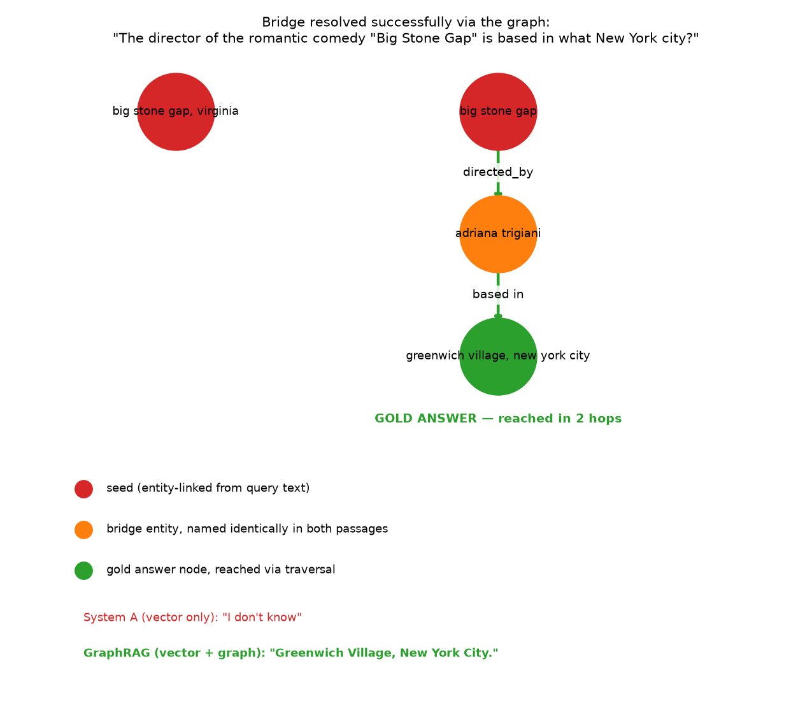
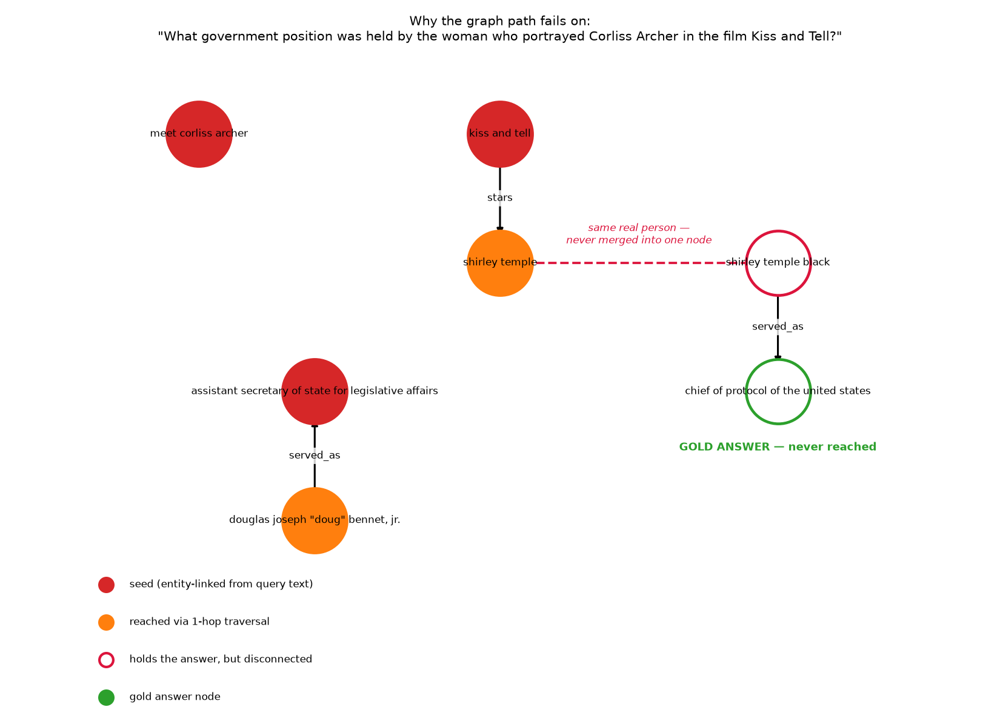
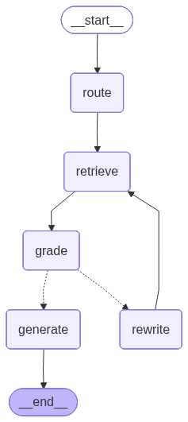

# Agentic GraphRAG

A from-scratch comparison of three retrieval strategies — **naive vector RAG**, **GraphRAG**, and an **agentic LangGraph-based GraphRAG** — evaluated on [HotpotQA](https://hotpotqa.github.io/), a multi-hop QA dataset built specifically to require combining facts across multiple documents.

The goal isn't to prove graphs always win. It's to build all three honestly, on the same corpus, and show *exactly where and why* one approach succeeds where another fails.

## Why HotpotQA

HotpotQA questions come in two flavors:
- **comparison** — both entities are named in the question ("Were Scott Derrickson and Ed Wood the same nationality?"). Vector search handles these fine.
- **bridge** — the question never names the entity that connects the answer to the question ("What government position was held by the woman who portrayed Corliss Archer in *Kiss and Tell*?" — never says "Shirley Temple"). This is where naive retrieval structurally breaks, and where a knowledge graph's multi-hop traversal should earn its keep.

Each question ships with `supporting_facts` — the exact sentences a human used to answer it — so retrieval quality can be checked against ground truth, not just final-answer string matching.

## Case study: one bridge question, two outcomes

To make the comparison concrete rather than aggregate-metric abstract, here are two real runs against the same pipeline, on the same partially-built graph.

### Where the graph succeeds

> *"The director of the romantic comedy 'Big Stone Gap' is based in what New York city?"* → **Greenwich Village, New York City**

Vector search retrieves the *Big Stone Gap* film page itself, plus four irrelevant films that happen to mention "New York" — it never finds the *Adriana Trigiani* passage that actually answers the question, and gives up:

> System A (vector only): *"I don't know."*

The graph retriever links the query to the `big stone gap` node, walks one hop (`directed_by → adriana trigiani`), then a second hop (`based in → greenwich village, new york city`) — because the LLM extractor named the bridging person identically in both source passages, the chain stays connected end to end:

> GraphRAG (vector + graph): **"Greenwich Village, New York City."**



### Where the graph also fails — and why

> *"What government position was held by the woman who portrayed Corliss Archer in the film Kiss and Tell?"* → **Chief of Protocol**

Here the bridging person was extracted under **two different surface forms** from her two source passages: `Shirley Temple` (from the film's page) and `Shirley Temple Black` (from her biography page). Plain `lower() + strip()` normalization doesn't catch that these are the same person, so they end up as two disconnected graph nodes. The walk reaches `shirley temple` and dead-ends — the fact that actually answers the question lives on the other, unreachable node. Both the vector-only and graph-augmented answers come back **"I don't know."**



This is the central, recurring failure mode of any LLM-extracted knowledge graph: **entity resolution, not graph traversal, is the hard part.** Fixing it means clustering aliases (edit-distance / token-overlap, or a second LLM canonicalization pass) before the graph is built — not just at query time.

Reproduce either case yourself: [`scripts/demo_bridge_success.py`](scripts/demo_bridge_success.py) / [`scripts/demo_bridge_question.py`](scripts/demo_bridge_question.py).

## System C: the agentic LangGraph state machine

This is the centerpiece of the project. Systems A and B are fixed pipelines — pick a retriever, retrieve once, generate. System C (`src/agent.py`) is a [LangGraph](https://github.com/langchain-ai/langgraph) state machine that decides *how* to retrieve, checks whether what it found is actually enough, and rewrites its own query and retries before giving up — rather than retrieving once and hoping.



*(rendered directly from the compiled graph via `agent.get_graph().draw_mermaid_png()` — not hand-drawn)*

**Nodes:**
- **route** — the LLM classifies the question into `vector` (single-passage lookup), `graph` (multi-hop), or `hybrid`, constrained to one word.
- **retrieve** — runs the retriever(s) implied by `route`, and **accumulates** results into the running context (deduped by chunk id) rather than replacing it on every call — see why below.
- **grade** — the LLM judges, against the *original* question, whether the accumulated context is sufficient; returns yes/no plus a one-line reason.
- **rewrite** — on a "no", the LLM rewrites the *retrieval* query (decomposing the bridge, or naming the connecting entity it suspects) and loops back to `retrieve`. Capped at `agent.max_retries` (2, in `config.yaml`) so a stubborn miss can't loop forever.
- **generate** — answers the *original* question from the accumulated context, citing the chunk id(s) used, e.g. `[chunk_43]`.

Two choices here diverge from the most literal reading of this loop, both forced by testing against real questions rather than picked upfront:

1. **Grading and final generation use the original question, never the rewritten one.** The rewritten text is a retrieval aid, not a replacement question — if it leaked into the final prompt, the agent would answer the sub-question it invented instead of the one actually asked.
2. **Context accumulates across retries instead of being replaced.** The first version replaced context on every `retrieve` call — the more obvious implementation. It broke exactly the question the loop was supposed to fix (next section).

### The loop earning its keep

Three questions run through the compiled agent (`python -m scripts.demo_agent`) land in the three states this graph can end in:

| Question | Route | Retries used | Final answer |
|---|---|---|---|
| "Were Scott Derrickson and Ed Wood of the same nationality?" | `graph` | 0 — sufficient immediately | "Yes, ... American `[chunk_1, chunk_4]`." |
| "The director of 'Big Stone Gap' is based in what New York city?" | `vector` | 2 — rewrite triggered | "...Adriana Trigiani, is based in Greenwich Village, New York City `[chunk_43]`." |
| "What government position was held by the woman who portrayed Corliss Archer in *Kiss and Tell*?" | `vector` | 2 — rewrite triggered | "...Shirley Temple. ...served as Chief of Protocol of the United States `[chunk_11]`." |

The third row is why context accumulation exists. Walking through it:

1. **route** classifies it `vector`.
2. **retrieve** runs vector search on the original question. It finds `chunk_16` (*Kiss and Tell*, which names Shirley Temple) but not her biography passage — the question never says her name, so nothing in it is textually close to her bio.
3. **grade** correctly says "no": nothing in context states what government position she held.
4. **rewrite** doesn't just rephrase — it uses the LLM's own world knowledge to name the bridge entity explicitly: *"What government position was held by Shirley Temple, the American actress and diplomat..."*
5. **retrieve** runs again on the rewritten query and finds `chunk_11` (her biography, with the Chief of Protocol fact) — **and keeps `chunk_16` from step 2** instead of discarding it.
6. **grade** is still conservative and says "no" again (it wants the *Kiss and Tell*/Corliss Archer link stated more explicitly); the loop has now used its 2 retries and proceeds to `generate` regardless.
7. **generate**, with both passages in context, correctly answers "Chief of Protocol of the United States `[chunk_11]`" — and correctly attributes the role to "the woman who portrayed Corliss Archer," because `chunk_16` is still there to ground that connection.

Without step 5's accumulation, this exact question regresses to "I don't know": a query specific enough to find Shirley Temple's bio has nothing to do with "Kiss and Tell" textually, so a context-*replacing* retrieve would throw away the one passage connecting her to the question at all. The bridge-question problem this whole project is built around — the connecting entity isn't named in the question — reappears one level deeper, inside the rewrite loop itself, and accumulation is what actually resolves it.

This also means System C recovers from a failure that defeated *both* System A and System B in the case study above: the Shirley Temple alias-split that fractured the graph (`shirley temple` vs `shirley temple black`) doesn't matter here, because the agent never depends on graph traversal connecting those two nodes — query rewriting reaches the answer passage through vector search instead.

## Architecture

```
HotpotQA (500 questions, distractor config)
        │
        ▼
  src/ingest.py  ──────────────►  data/corpus.jsonl   (4,937 deduped passages)
                                   data/questions.jsonl

        ┌───────────────────────────────┴───────────────────────────────┐
        ▼                                                               ▼
 System A: naive vector RAG                              System B: GraphRAG
 src/vector_store.py                                     src/extract_triples.py
   - bge-small-en-v1.5 embeddings                          - LLM-extracted (head, relation, tail)
   - FAISS IndexFlatIP (cosine)                             triples, batched + resumable
                                                           src/graph_store.py
                                                             - networkx.MultiDiGraph
                                                             - query → entity-linking → k-hop walk
                                                             - edge-level source-chunk collection
        └───────────────────────────────┬───────────────────────────────┘
                                         ▼
                              src/generate.py
                         (shared context-grounded prompt,
                          shared across all systems via LiteLLM)

 System C: src/agent.py — LangGraph agent that routes between vector/graph
 retrieval, grades retrieved context, rewrites the query on a miss, and
 cites source chunk ids in its final answer. See the dedicated section above.
```

All three systems share the same corpus, the same embedding model, and the same generation prompt — only the retrieval step differs. That's deliberate: it isolates retrieval strategy as the only variable being compared.

## Status

| Phase | Component | Status |
|---|---|---|
| 0 | Config (`config.yaml`, `src/config.py`) | done |
| 1 | Ingest HotpotQA → corpus (`src/ingest.py`) | done — 4,937 passages from 500 questions |
| 2 | System A: vector index + retrieval (`src/vector_store.py`) | done |
| 3 | Triple extraction (`src/extract_triples.py`) | in progress — 350 / 4,937 chunks extracted |
| 3 | Graph construction + k-hop retrieval (`src/graph_store.py`) | done, validated on the partial graph above |
| 4 | System C: LangGraph agentic router/grader/rewriter (`src/agent.py`) | done, validated on the partial graph above |
| 5 | Evaluation harness (ragas) across all three systems | not started |

Triple extraction is bottlenecked by free-tier LLM rate limits (Groq: 100k tokens/day; Gemini: 20 requests/day on the current API key) rather than anything algorithmic — it resumes safely across runs via an on-disk JSONL ledger keyed by `chunk_id`, so it's just a matter of letting it run across multiple days, or switching to a paid tier.

## Setup

```bash
conda create -n agentic-graphrag python=3.11
conda activate agentic-graphrag
pip install -r requirements.txt
cp .env.example .env   # then fill in GEMINI_API_KEY / GROQ_API_KEY
```

## Running the pipeline

```bash
python -m src.ingest              # build data/corpus.jsonl + data/questions.jsonl
python -m src.vector_store        # build + cache the FAISS index (System A)
python -m src.extract_triples     # LLM-extract triples → data/triples.jsonl (resumable)
python -m src.graph_store         # build the graph from cached triples (System B)
python -m scripts.demo_bridge_success    # walk + visualize a working bridge case
python -m scripts.demo_bridge_question   # walk + visualize the entity-resolution failure case
python -m scripts.demo_agent             # run System C across all three cases above
```

Each script is independently resumable and reads from cached `data/*.jsonl` / `data/*.pkl` artifacts where available, so re-running the pipeline doesn't redo expensive embedding or LLM-extraction work.

## Repository layout

```
src/
  config.py          # loads config.yaml
  ingest.py           # HotpotQA → corpus.jsonl / questions.jsonl
  vector_store.py      # FAISS-backed System A retriever
  generate.py          # shared context-grounded generation prompt (LiteLLM)
  extract_triples.py   # batched, resumable LLM triple extraction
  graph_store.py        # graph construction + k-hop GraphRetriever (System B)
  agent.py             # LangGraph router/retrieve/grade/rewrite/generate agent (System C)
  llm.py               # thin LiteLLM wrapper (model-agnostic completion)
scripts/
  demo_bridge_success.py   # case study: graph traversal succeeds
  demo_bridge_question.py  # case study: graph traversal fails (entity-alias gap)
  demo_agent.py             # System C across all three cases
config.yaml          # models, embedding model, top_k, k_hops, max_retries, dataset params
assets/                # diagrams referenced in this README (tracked, unlike data/)
```

`data/` (HotpotQA cache, FAISS index, extracted triples, graph pickle) is gitignored — regenerate it locally via the commands above.
